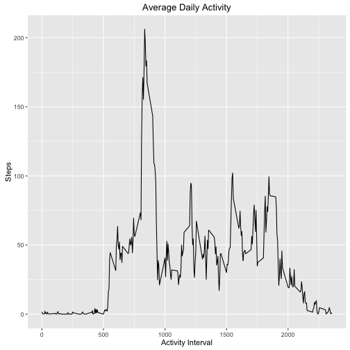
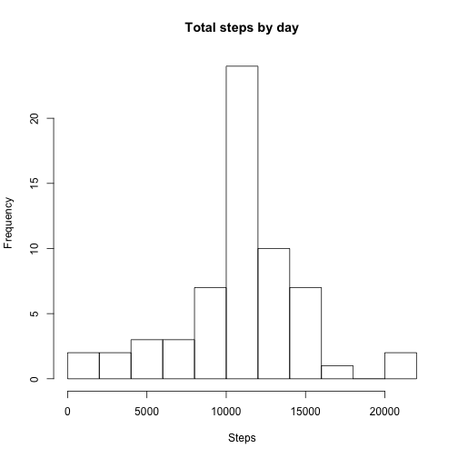
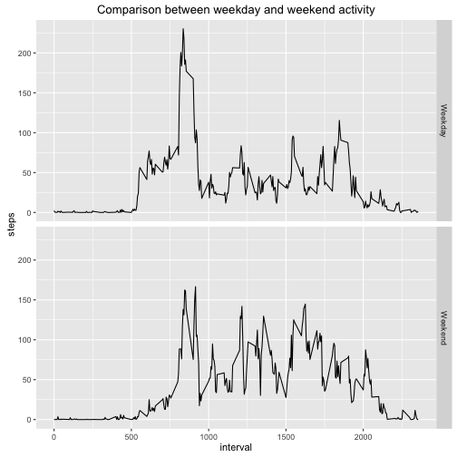

## Loading and preprocessing the data


```r
# load the data
activity <- read.csv("activity.csv")
# split na values and non na values 
na_steps <- activity[is.na(activity$steps),]
steps <- activity[!is.na(activity$steps), ]
```

## What is mean total number of steps taken per day?

1. Make a histogram of the total number of steps taken each day 

```r
# get total steps by day
total_steps <- aggregate(steps ~ date, data = steps, sum)
# plot histogram of the data
hist(total_steps$steps, main = "Total steps by day", xlab = "Steps", breaks = 10)
```


2. Calculate and report the mean and the median of the steps

```r
# calculate and report the mean and the median of the steps
    mean(total_steps$steps)
```

```
## [1] 10766.19
```

```r
    median(total_steps$steps)
```

```
## [1] 10765
```

## What is the average daily activity pattern?

1. Make a time series plot of the 5-minute interval (x-axis) and the average number of steps taken, averaged across all days (y-axis)


```r
# calculate the mean of steps taken by interval
activity_mean <- aggregate(steps ~ interval, data = steps, mean)
# plot data in timeline format
qplot(activity_mean$interval, activity_mean$steps, geom= "line", xlab = "Activity Interval", 
         ylab = "Steps", main = "Average Daily Activity")
```



2. Calculate and report the maximum steps interval

```r
# calculate and report the maximum steps interval
max_interval <- activity_mean[max(activity_mean$steps), ]
print(max_interval$interval)
```

```
## [1] 1705
```

## Imputing missing values

1. Calculate and report the total number of missing values in the dataset

```r
# calculate and report the total number of missing values
na_values <- dim(na_steps)[1]
```
2. Replace the NA values with the average value for interval

```r
# merge the original dataset and the mean by interval dataset calculated before to match
# each interval value with the corresponding mean of that interval
interval_mean <- aggregate(steps ~ interval, data= steps, mean)
complete <- merge(activity, interval_mean, by.x = "interval", by.y = "interval", all = TRUE)
# find which positions are filled with NA values in the steps.x column and replace that value
# with the mean of the interval which is in the new steps.y column
complete$steps.x[which(is.na(complete$steps.x))] <- complete$steps.y[which(is.na(complete$steps.x))]
```
3. Make a histogram of the total number of steps taken each day

```r
# plot an histogram using the new dataset
total_steps.x<- aggregate(steps.x ~ date, data = complete, sum)
hist(total_steps.x$steps, main = "Total steps by day", xlab = "Steps", breaks = 10)
```



4. Calculate and report the mean and median total number of steps taken per day.


```r
mean(total_steps.x$steps.x)
```

```
## [1] 10766.19
```

```r
median(total_steps.x$steps.x)
```

```
## [1] 10766.19
```
The overal pattern in the histogram has not changed, there are more values in the middle column. The mean value has also mover slightly to the middle value.

## Are there differences in activity patterns between weekdays and weekends?

1. Create a new factor variable in the dataset with two levels – “weekday” and “weekend” indicating whether a given date is a weekday or weekend day.


```r
# auxiliar function to check if a given day is a Weekend day or a Weekday
week <- function(date){
    if(date== "sábado" | date== "domingo"){ result <- "Weekend"}
    else { result <- "Weekday"}
    result
}
```


```r
# Create a new column in the activity dataset to store information about a day
# being a weekday or a weekend day
complete <- transform(complete, date = as.Date(complete$date, format="%Y-%m-%d"))
days <- weekdays(complete$date)
for (i in 1:length(days)) {
    days[i] <- week(days[i])
}
complete$week <- days
```

2. Make a panel plot containing a time series plot of the 5-minute interval and the average number of steps taken, averaged across all weekday days or weekend days.


```r
# calculate the average activity by interval and also by weekday
data <- aggregate(steps.x ~ interval + week, data = complete, mean)
# plot the data
qplot(interval, steps.x, data = data, geom = "line", facets = week~., 
          ylab = "steps", main = "Comparison between weekday and weekend activity")
```


